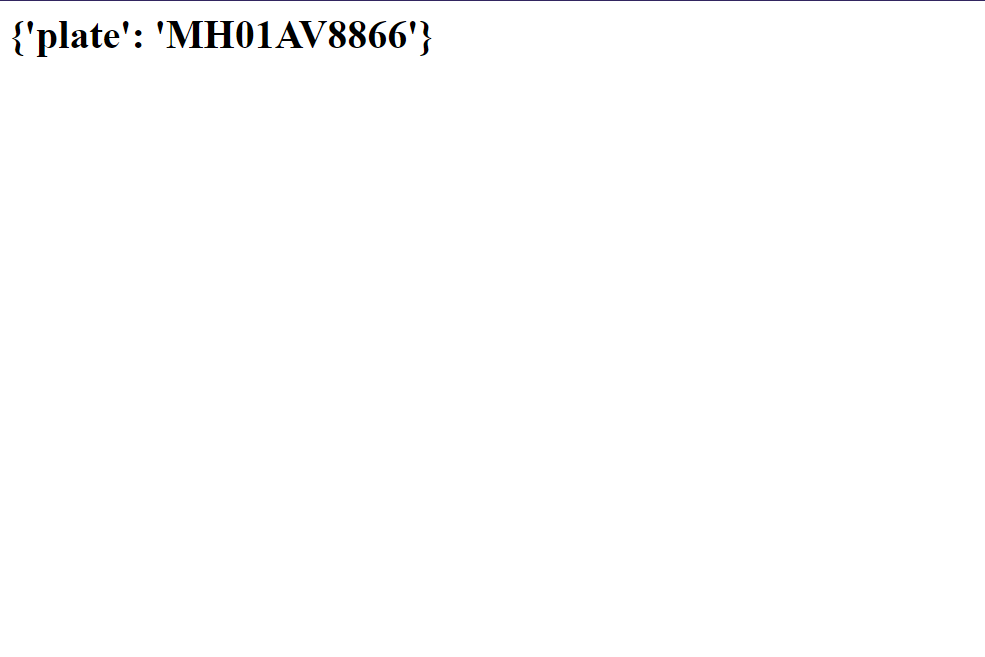

# FastAPI server for Number Plate Recognition
A server using TFOD2 custom trained model to localize on the numberplate in an image and after that using Cloud Vision API to extract characters from the image.


## Project Structure
```bash
├───ANPR_centernet_resnet50_model
│   ├───checkpoint
│   └───saved_model
│       ├───assets
│       └───variables
├───object_detection
├───image_to_text.py
├───label_map.pbtxt
├───requirements.txt
├───stripe_customer.py
├───translation-322819-fd44443f9785.json
└───official
```

## Demo

<figure>
    <figcaption>car image</figcaption>
    
    
</figure>

<figure>
    <figcaption>created upload page</figcaption>
    
    
</figure>

<figure>
    <figcaption>output of numberplate</figcaption>
    
    
</figure>

>  To use the object detection model, we need "official" folder from [official](https://github.com/tensorflow/models) and "object_detection" folder from [object_detection](https://github.com/tensorflow/models/tree/master/research)

## Run Locally

1. Create a virtual env using any python version >= 3.7.

2. Install the required dependencies and run the following command in the project folder: 
```bash
pip install -r requirements.txt
```

3. To start local server:
```bash
uvicorn image_to_text:app --port 8000 --host 0.0.0.0
```

## Deploying on VM
1. After logging in as root user, run this commaand:
 ```bash
apt update
```
2. Create a project folder. Our folder lies at /app/python_server. Use scp command to transfer files to VM or clone this repo using git.

3. We are going to use python3 which comes preinstalled in most linux VMs. But we need to install pip separately using:
  ```bash
apt-get install python3-pip
```
> :memo: **Note:** Ideally it's advised to create a virtual python environment and then install all the packages. 

4. Install the required dependencies and run the following command in the project folder:
```bash
pip install -r requirements.txt
```

5. To keep the server running, we need to create a service file in the path /etc/systemd/system/toll-booth.service. We will be using gunicorn server for deployment whose commands are already mentioned in the file.

6. To start the service
```bash
systemctl start toll-booth.service
```

And to keep the server running even after reboot, run the following command:
```bash
systemctl enable toll-booth.service
```
